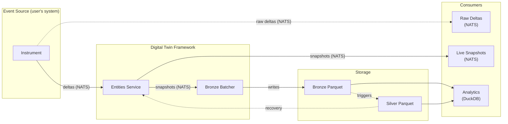

# v2-experiment

[](https://github.com/go-digitaltwin/v2-experiment/actions/workflows/ci.yml)

A digital twin framework for event-driven systems in Go.

**Input at runtime**: domain-specific deltas (partial updates describing
observed changes in the physical system). **Input at compile time**: a formal
domain model defined as Go structs. **Output**: partitioned Parquet files
(bronze snapshots, silver baselines) and a stream of per-entity snapshot updates
over NATS.

## Why

This repository is an experimental playground: a space to demonstrate
feasibility and evolve the concepts behind analytics-enabled digital twins
before placing them in proper repositories under
[go-digitaltwin](https://github.com/go-digitaltwin).

## Core Concepts

- **Domain model**: A compile-time schema of entity types. Each entity type has
  a primary key, zero or more properties, and optional relationships to other
  entity types. Defined as Go structs.
- **Delta model**: Partial updates expressed per field as _assert_ (we know this
  value), _retract_ (previously asserted value is no longer valid), or _ignore_
  (field is unaffected). See [docs/design.md](docs/design.md) for motivation.
- **Medallion storage**: A two-tier Parquet layout. Bronze stores both raw
  deltas and full-state snapshots within windows. Silver stores the latest state
  of every known entity.
- **NATS messaging**: Services communicate through NATS subjects, enabling
  independent scaling and loose coupling.

## Architecture

The event source is external (the user's system). The framework boundary starts
at deltas-in and ends at Parquet-out and snapshots-out.



## Repository Layout

```
v2-experiment/
  docs/           Design documents, ADRs, and reference material
  sample/         Concrete domain model examples (future)
```

## Status

Experimental. Expect breaking changes.

## License

[MIT](LICENSE)
