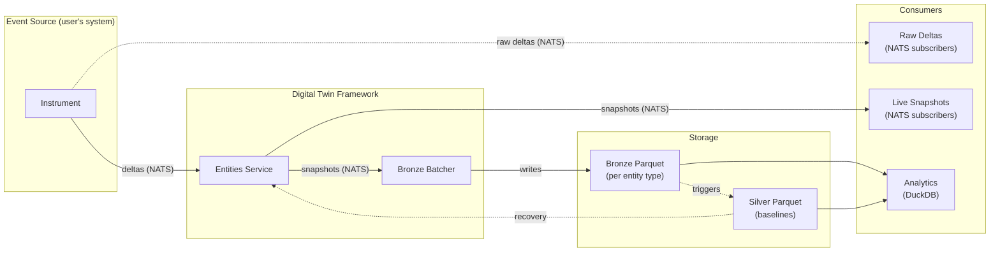

# Design

The digital twin framework translates events from instrumented systems into a
continuously updated domain model stored in Parquet format for analytics and
state recovery.

## Vision

Event-driven systems instrument a live physical system and produce events. Each
event captures a narrow observation: a change in one component, a measurement
from one sensor, a state transition in one subsystem. Individually, these events
are ephemeral. Collectively, they describe the evolving state of the whole
system.

The digital twin sits on the receiving end. It consumes these events, expressed
as deltas conforming to a formal domain model, and maintains an authoritative
in-memory representation of every known entity. That representation is persisted
as Parquet files in a medallion architecture (bronze snapshots, silver
baselines), enabling columnar analytics (sub-second queries over millions of
rows via DuckDB), offline and online processing, and state recovery without a
dedicated database.

The approach resembles git's storage model: store full revisions at each point
in time; compute diffs on the fly when needed.

## Why Deltas

The framework works with per-field partial updates rather than whole-row
replacements. The reasoning follows from how instruments observe the world:

1. **Narrow observation windows.** Instruments observe a running system through
   narrow windows. A single event rarely reveals the full state of any entity;
   it provides partial information where some fields are known and others are
   absent.

2. **Column-level partial observability.** In complex systems this partial
   observability decomposes to the column level: any given event may assert a
   value for one property while saying nothing about the rest.

3. **Decoupled producers.** Replacing entire rows would require the producer to
   know the complete current state before emitting an update. That couples the
   event source to the twin's state and defeats the purpose of decoupled
   instrumentation.

4. **Overlays, not replacements.** Deltas act as overlays: each delta declares
   per field whether to assert a new value, retract a previous one, or leave the
   field untouched. The twin merges overlays into the authoritative snapshot,
   similar to how rsync's rolling-checksum protocol transmits only the changed
   blocks rather than the entire file.

5. **Simple producers, powerful framework.** This design solves the harder
   technical problem (partial updates with field-level granularity) so that
   event sources remain simple, stateless, and composable.

## Architecture

Two framework services communicate via NATS. The event source is the user's
responsibility; it produces deltas conforming to the domain model and publishes
them to NATS. Each framework service has distinct scaling characteristics and
can be developed, deployed, and scaled independently.



### Entities Service

Subscribes to delta subjects on NATS. For each incoming delta, applies
assert/retract/ignore operations to the in-memory state of the target entity and
emits the resulting full snapshot on a per-entity NATS subject.

The service is schema-aware: it knows the keys and properties of each entity
type in the [domain model](#domain-model).

State recovery uses silver-tier Parquet baselines; no separate database.

**Input**: Entity deltas from NATS. **Output**: Full entity snapshots on NATS.

### Bronze Batcher

A separate service that subscribes to entity snapshot subjects on NATS, batches
them within configurable time and size windows, and writes one Parquet file per
entity type. Each write emits a "committed" event on NATS so downstream
consumers (including the future silver-tier service) can react.

Batching and writing Parquet requires a single writer, while the Entities
service has very different memory and CPU characteristics; hence the separation.

**Input**: Entity snapshots from NATS. **Output**: Bronze Parquet files (one per
entity type per window). Commit events on NATS.

## Domain Model

A domain model is a set of entity types that describe the physical system being
observed. Each entity type has:

- A **primary key** (single field or composite) that uniquely identifies an
  instance.
- Zero or more **properties** representing observable state.
- Optional **foreign keys** referencing other entity types.

Domain models are defined at compile time as Go structs, with metadata provided
through struct tags or explicit type registration with the framework. Runtime
definition (loading schemas from configuration) may be added later. See
`sample/` (future) for concrete examples.

### Entity Relationships

Entities may reference each other via foreign keys. When an event implies that a
previous association is stale (e.g., a foreign key moves from one entity to
another), domain causality rules can infer the corresponding retraction. The
full set of causality rules is domain-specific and emerges during
implementation.

## Delta Model

The delta model expresses sparse updates to entity state. Each delta targets one
entity and applies one of three operations per property:

| Operation   | Meaning                                         | Example                   |
| ----------- | ----------------------------------------------- | ------------------------- |
| **Assert**  | We know this property value.                    | Entity.Property = "value" |
| **Retract** | A previously asserted value is no longer valid. | Entity.Property retracted |
| **Ignore**  | This property is unaffected (no-op).            | Entity.Property unchanged |

Event sources provide partial information. A single event rarely populates all
properties of an entity. The assert/retract/ignore model handles this sparsity
naturally. See [Why Deltas](#why-deltas) for the full motivation.

Consumers of the Entities Service's snapshots may apply **domain causality** to
infer additional retractions or assertions based on domain-specific rules.

The delta model may align with CRDTs (Conflict-free Replicated Data Types) in
the future, but that relationship is not yet defined.

## Storage

The system follows a medallion architecture with two tiers.

Both tiers use [Hive-style partitioning][hive-part]: directories named with
`key=value` segments that DuckDB (and other engines) discover automatically as
virtual columns, enabling partition pruning on queries.

Partition keys: `kind` (entity type) and `date` (calendar day) are firm
requirements. The exact path composition, directory contents (multiple chunks
per directory are expected), and intra-day time partitioning remain to be
clarified. The following layout is illustrative:

```
bronze/
  kind=<entity-type>/
    date=<YYYY-MM-DD>/
      <timestamp>.parquet
      ...

silver/
  kind=<entity-type>/
    date=<YYYY-MM-DD>/
      baseline.parquet
```

Intra-day partition levels (e.g., `hour=`, `minute=`) can be introduced later
under the same `date=` partition without breaking existing queries; DuckDB
discovers new Hive levels automatically.

### Bronze Tier

The bronze tier persists both of the framework's ephemeral NATS streams as
Parquet files: the raw input (deltas) and the materialized output (snapshots).

- A **snapshot batch** contains full entity snapshots. Each row represents the
  complete state of one entity at one point in time, including unchanged fields.
- A **delta batch** contains raw deltas as received from the event source,
  preserving the original input for auditing, replay, and fine-grained change
  analysis.

Both batch types coexist within a window (one file of each type per entity
type).

Bronze files are:

- Partitioned by `kind` and `date`.
- Named by their window timestamp (ISO 8601, hyphens replacing colons for
  filesystem compatibility).
- Target window: configurable by time and file size.
- Immutable once committed.

Storing full snapshots (rather than sparse deltas) trades storage for
simplicity. Diffs can be computed on the fly using DuckDB or similar engines,
avoiding the complexity of producing columnar delta files in Go.

### Silver Tier

Acts as a "database table" for each entity type. Holds the latest version of
every known entity, even those unchanged since the previous partition. Serves
analytics and state recovery.

To build a silver file at time T+1:

1. Read the silver baseline from time T.
2. Apply all snapshots from the bronze file at time T+1 (latest snapshot per
   entity wins).
3. Write the result as the new silver baseline.

Silver files are partitioned by `kind` and `date`. Each date partition holds the
baseline produced from that day's final bronze commit. Silver files serve two
purposes:

- **Analytics**: Query the current state of the world without scanning all
  bronze files.
- **State recovery**: The Entities Service loads the latest silver baseline at
  startup instead of replaying all bronze history.

Retention policy for silver baselines (how many to keep, tombstone handling) is
deferred to implementation time. Table formats such as [Apache Iceberg][iceberg]
could manage silver files in the future (schema evolution, time travel, ACID
guarantees), but that decision is deferred.

## Outputs

The digital twin framework provides four output interfaces:

| Output         | Transport   | Description                                           |
| -------------- | ----------- | ----------------------------------------------------- |
| Bronze Parquet | File system | Timestamped snapshots within windows, per entity type |
| Silver Parquet | File system | Latest-state baselines, per entity type               |
| Raw deltas     | NATS        | Input subjects; any consumer can subscribe            |
| Live snapshots | NATS        | Per-entity full snapshots emitted by Entities Service |

Both Parquet outputs emit "committed" events on NATS when a file is written,
enabling reactive downstream processing.

## Implementation Plan

### Phase 1: Domain Model and Core Services

1. Define domain model primitives: entity types, primary keys, and the
   assert/retract/ignore delta model.
2. Implement code generation for delta builders and snapshot types.
3. Implement the Entities Service: subscribe to deltas, maintain in-memory
   state, emit full snapshots to NATS.
4. Implement the Bronze Batcher: subscribe to snapshots, batch by time/size,
   write Parquet files per entity type.

### Phase 2: Silver Tier and Recovery

5. Implement the silver baseline service (triggered by bronze commit events).
6. Add state recovery to the Entities Service (load latest silver baseline at
   startup).

### Phase 3: Production Integration

7. Retention policies for bronze and silver files.
8. Diff computation utilities (on-the-fly from bronze snapshots).

## Risks and Open Questions

| Risk / Question                         | Status   | Notes                                                                                                              |
| --------------------------------------- | -------- | ------------------------------------------------------------------------------------------------------------------ |
| Nested arrays in Parquet                | Decided  | Named structs nested as repeated types within parent entities. Parquet and Arrow support nested/repeated natively. |
| CRDT alignment                          | Deferred | The delta model may map to CRDTs; relationship unexplored.                                                         |
| Tombstone retention in silver baselines | Deferred | When and how to prune tombstoned entities from baselines.                                                          |
| Domain causality rules                  | Open     | Rules are domain-specific. The framework must support them; the full set emerges during implementation.            |
| Go Parquet library choice               | Decided  | `parquet-go/parquet-go` for Parquet I/O; `apache/arrow-go` may complement it later.                                |
| NATS subject naming convention          | Open     | Needs definition per domain model.                                                                                 |
| Silver tier file growth                 | Deferred | Silver files grow with every known entity. Retention and partitioning strategy needed.                             |

## References

- Whiteboard diagram:
  [whiteboard-architecture.md](reference/whiteboard-architecture.md)

[hive-part]: https://duckdb.org/docs/data/partitioning/hive_partitioning
[iceberg]: https://iceberg.apache.org/
